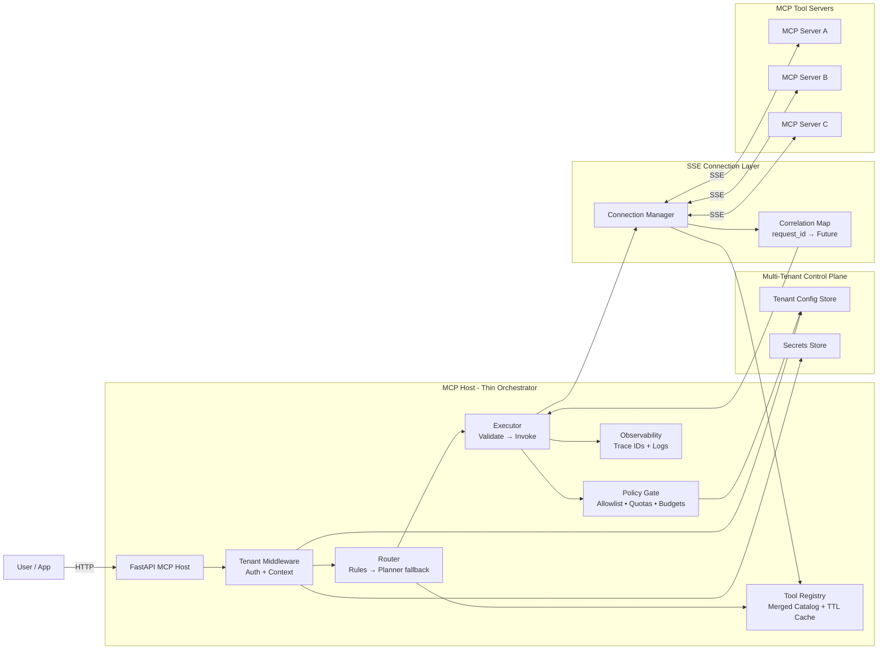

```mermaid
flowchart LR
  U[User / App] -->|HTTP| API[FastAPI MCP Host]

  subgraph HOST[MCP Host - Thin Orchestrator]
    API --> MW[Tenant Middleware<br/>Auth + Context]
    MW --> RT[Router<br/>Rules → Planner fallback]
    RT --> EX[Executor<br/>Validate → Invoke]
    EX --> POL[Policy Gate<br/>Allowlist • Quotas • Budgets]
    RT --> REG[Tool Registry<br/>Merged Catalog + TTL Cache]
    EX --> OBS[Observability<br/>Trace IDs + Logs]
  end

  subgraph CFG[Multi-Tenant Control Plane]
    TC[Tenant Config Store]
    SEC[Secrets Store]
  end

  MW --> TC
  MW --> SEC
  POL --> TC

  subgraph CONN[SSE Connection Layer]
    CM[Connection Manager]
    CORR[Correlation Map<br/>request_id → Future]
  end

  EX --> CM
  CM --> CORR
  CORR --> EX

  subgraph SRV[MCP Tool Servers]
    S1[MCP Server A]
    S2[MCP Server B]
    S3[MCP Server C]
  end

  CM <-->|SSE| S1
  CM <-->|SSE| S2
  CM <-->|SSE| S3
  CM --> REG
```