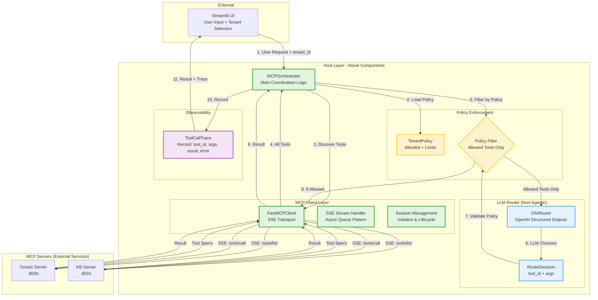

# Host Architecture - Mermaid Diagram

## Overview
The host layer implements a **thin orchestrator pattern** where policy is enforced outside the LLM, and the model acts purely as a router (not an agent). This architecture ensures tenant isolation, tool governance, and observability.

## Architecture Diagram

